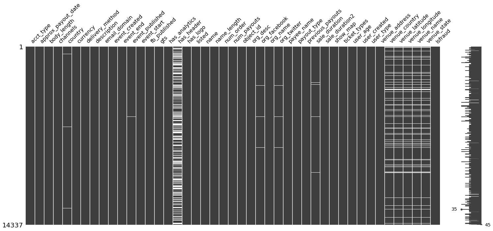
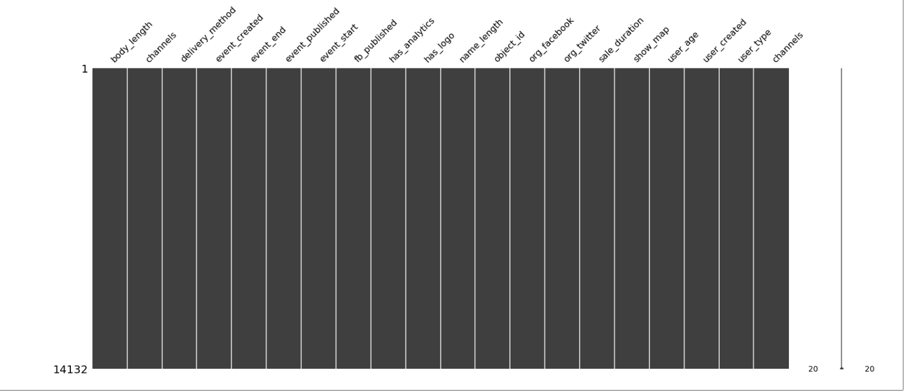
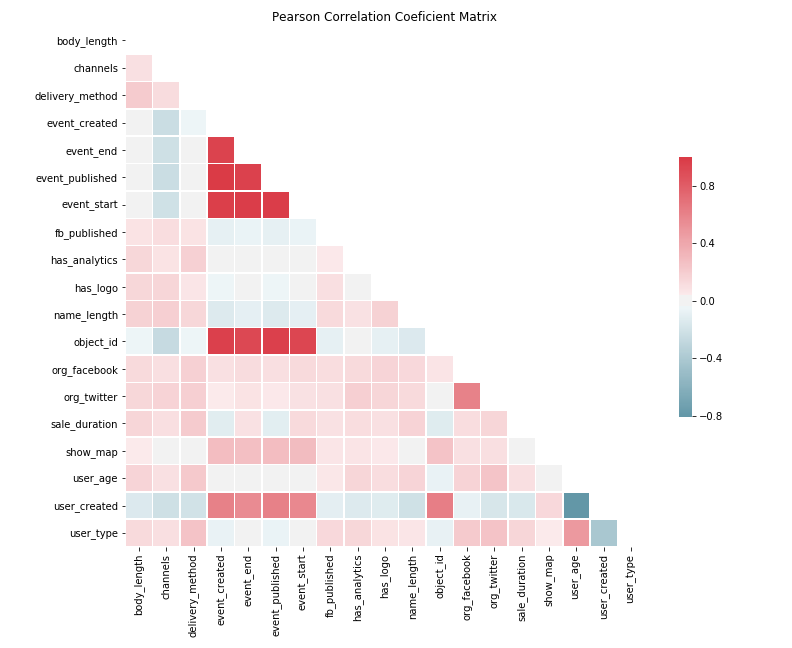
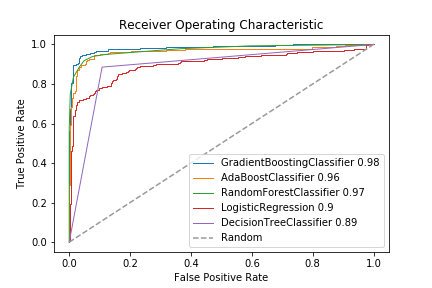
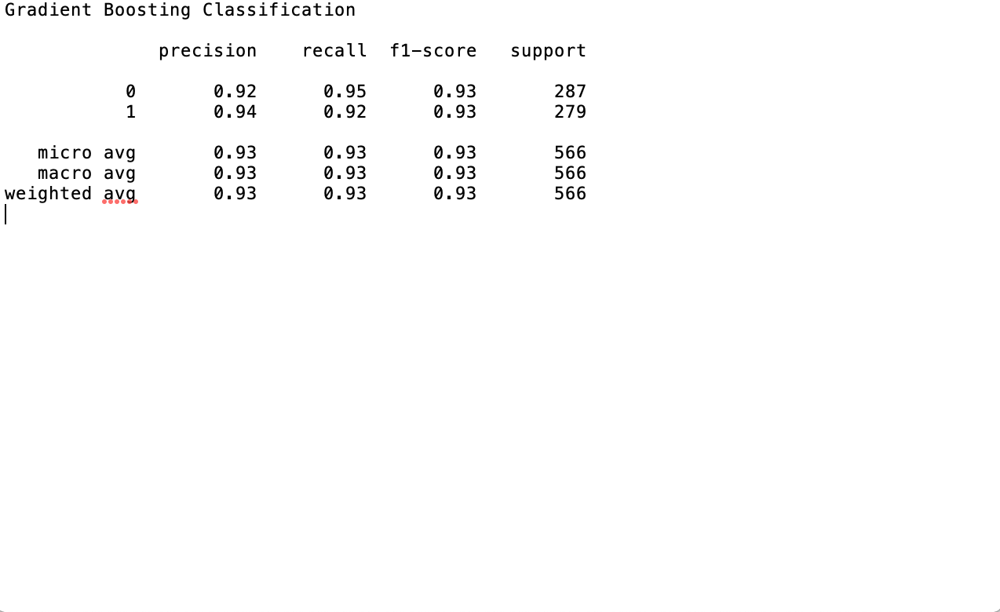
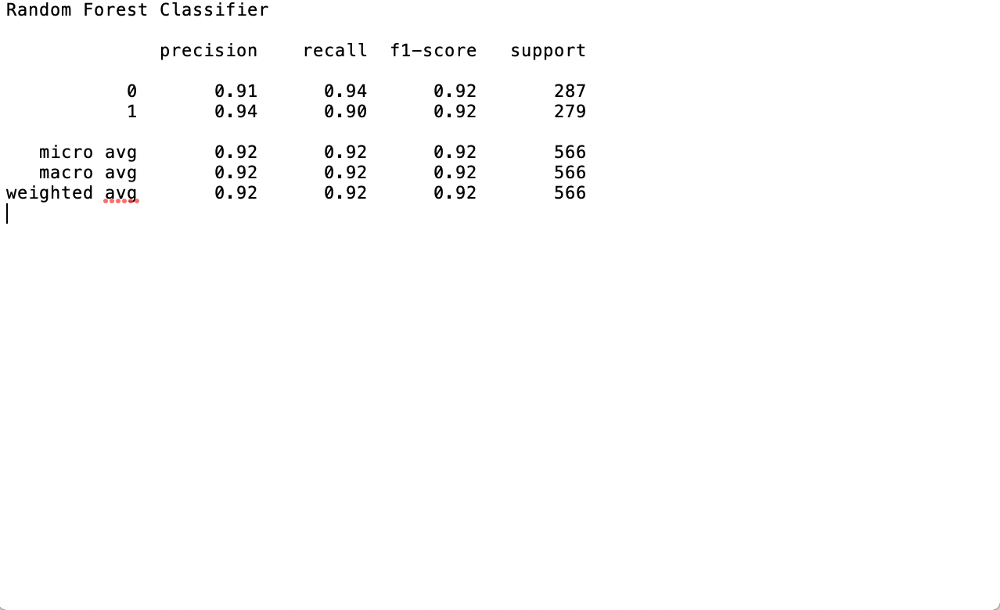

# Fraud Detection Case Study

### Group

- Jasmine He
- Trent Fowler
- Ryan Curry
- Ross Kantor
- Emily Levis

### Objectives

- To build a user-facing web app which takes new data and characterizes it as a 'low risk' or 'high risk' of being fraud.
- Gain fluency with flask, AWS, and databases.

### EDA

We began by plotting missing values in our data in a bid to determine what needed to be discarded and what had enough density to be useful.

On the basis of this plot we dropped all but the 'body_length', 'channels', 'delivery_method', 'event_created', 'event_end', 'event_published', 'event_start', 'fb_published', 'has_analytics', 'has_logo', 'name_length', 'object_id', 'org_facebook', 'org_twitter', 'sale_duration', 'show_map', 'user_age', 'user_created', 'user_type' channels:

Collinearity remains a potential issue. Even though there was some correlation between input values, we didn't think there was enough to worry about:

### Class balancing

In order to proceed we first had to address the issue of unbalanced classes. When one of the classes in a dataset is much smaller than the other you run the risk of your models simply never predicting an instance of the smaller class.

Since most people don't have cancer, a 'cancer-detecting' model could do pretty well by telling everyone that they don't have cancer; as you can imagine, this is of limited usefulness.

So we did a very basic balancing procedure. We determined how many instances of fraud there were and randomly sampled from the non-fraud data to create a new dataset which was 50% fraud and 50% non-fraud.

This technique of trimming the majority class down to the size of the minority class is called 'downsampling'. It's also possible to 'upsample' by going in the opposite direction, bootstrapping the minority class up to the same size as the majority class.

Since the fraudulent data were so sparse, this latter approach seemed unwise.

### Model building

We built and tested a number of basic predictive models with our balanced data in order to determine which would yield the best results. Ranked in order of success the models were a Gradient Boosting Classifier, Random Forest Classifier, Adaptive Boosting Classifier, Logistic Regression Classifier, and Decision Tree Classifier.

Here is how they performed:

Digging in a bit to our two top performers:

We chose to move forward with the Gradient Boosting Classifier, which involved pickling it and sending it to our flask app.

### Database

There are a variety of database technologies available, of which we chose to use the popular postgreSQL.

We created a 'fraud' database containing a table called 'fraud_checker', which houses all the inputs being fed to our pickled predictive model along with the model's probability estimate of the input being a fraud or not.

### Flask

Flask is a micro web framework written in python. It's aim is to allow for extremely quick deployment of web-based applications.

We had to make sure that our flask app was able to speak to our postgreSQL database to process new queries and write to the database.

### Workflow

#### What do we want to be able to do?
We want to take a new row of input data, unpickle our predictive model, classify it as 'fraud' or 'not fraud', and then add that row to the existing database.

#### What are we actually able to do?
We got all of the data transformations that we wanted. We successfully built the postgreSQL database and got flask up running, and managed to get them talking to each other.
